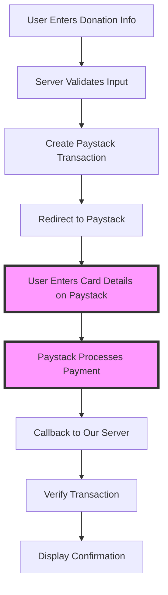

# PCI DSS Compliance Procedures - StudentePlein Donation Portal

**Document Version:** 1.0  
**Effective Date:** January 2025  
**Review Date:** January 2026  
**Classification:** Confidential  
**Owner:** StudentePlein Technical Team

---

## Executive Summary

The StudentePlein Donation Portal maintains PCI DSS compliance through a **redirect-based payment architecture** that eliminates cardholder data from our environment. This document outlines the specific procedures, controls, and validation requirements to maintain **SAQ A** (Self-Assessment Questionnaire A) compliance level.

**Key Compliance Factors:**
- ✅ No cardholder data storage, processing, or transmission
- ✅ All payment processing handled by PCI Level 1 certified provider (Paystack)
- ✅ Secure redirect-based payment flow
- ✅ Proper webhook verification and API security

---

## 1. PCI DSS Scope and Classification

### 1.1 Compliance Level: SAQ A

**Qualification Criteria:**
- [x] Card-not-present merchant
- [x] All cardholder data functions outsourced to PCI DSS validated service providers
- [x] No electronic storage, processing, or transmission of cardholder data
- [x] No influence over how cardholder data is processed

**Annual Requirements:**
- Complete SAQ A questionnaire
- Maintain ASV (Approved Scanning Vendor) quarterly scans
- Attestation of Compliance (AOC) submission
- Policy and procedure documentation

### 1.2 In-Scope Systems

| System | Component | PCI Scope | Risk Level |
|--------|-----------|-----------|------------|
| **Donation Portal** | Next.js Application | In-Scope | Medium |
| **API Endpoints** | Payment initialization & verification | In-Scope | Medium |
| **Webhooks** | Paystack event processing | In-Scope | Medium |
| **Database** | Transaction metadata only | In-Scope | Low |
| **Cloudflare Workers** | Hosting infrastructure | In-Scope | Low |
| **Development Environment** | Local development | Out-of-Scope | N/A |

### 1.3 Out-of-Scope Systems

- **Paystack Payment Pages**: Handled by PCI Level 1 provider
- **Card Processing**: No direct interaction with cardholder data
- **Administrative Systems**: No payment data access
- **Analytics Platforms**: Anonymized data only

---

## 2. Payment Flow Security Controls

### 2.1 Payment Architecture Overview



**Critical Security Boundary:** Steps E and F occur entirely on Paystack's PCI-compliant infrastructure.

### 2.2 Payment Initialization Security (`/api/subscription/initialize`)

**Security Controls:**
```typescript
// Input Validation
const validated = yield* Schema.decodeUnknown(CreateSubscriptionRequestSchema)(body);

// Email Sanitization
const trimmedEmail = validated.email.trim();
if (!trimmedEmail || trimmedEmail.length === 0) {
  return yield* Effect.fail(new BadRequestError("Email is required"));
}

// Secure API Communication
const result = yield* initializeTransaction({
  email: trimmedEmail,
  amount: plan.amount * 100,
  callback_url: `${process.env.NEXT_PUBLIC_APP_URL}/donation/callback`,
  metadata: { /* Non-sensitive metadata only */ }
});
```

**Compliance Verification:**
- [ ] No cardholder data collected or processed
- [ ] Input validation prevents injection attacks
- [ ] Secure communication with Paystack API
- [ ] Error handling without sensitive data exposure

### 2.3 Transaction Verification Security (`/api/subscription/verify`)

**Data Filtering Implementation:**
```typescript
function createSafeTransactionResponse(transaction: Record<string, unknown>) {
  // Only return non-sensitive transaction data
  return {
    amount: transaction.amount,
    currency: transaction.currency,
    reference: transaction.reference,
    plan: transaction.plan,
    customer: { email: customer?.email },
    metadata: { plan_interval: metadata?.plan_interval }
  }
}
```

**Compliance Verification:**
- [ ] Sensitive data filtered from API responses
- [ ] Transaction verification server-side only
- [ ] No cardholder data in verification process
- [ ] Proper error handling for failed verifications

### 2.4 Webhook Security (`/api/webhooks/paystack`)

**HMAC Signature Verification:**
```typescript
function verifyWebhookSignature(payload: string, signature: string): boolean {
  const secret = process.env.NEXT_PAYSTACK_SECRET_KEY!
  const hash = crypto.createHmac('sha512', secret).update(payload).digest('hex')
  return hash === signature
}
```

**Security Controls:**
- [ ] HMAC SHA-512 signature verification implemented
- [ ] Webhook payload validation with schemas
- [ ] No sensitive data logging in webhook handlers
- [ ] Proper error handling for invalid webhooks

---

## 3. PCI DSS Requirements Compliance Matrix

### 3.1 Build and Maintain a Secure Network (Requirements 1-2)

| Requirement | Implementation | Verification Method | Status |
|-------------|----------------|-------------------|---------|
| **1.1** Firewall Configuration | Cloudflare WAF + Network policies | Configuration review | ✅ |
| **1.2** Network Configuration | Cloudflare Workers environment | Architecture documentation | ✅ |
| **2.1** Vendor Defaults | Custom configurations, no defaults | Configuration audit | ✅ |
| **2.2** System Hardening | Security headers, CSP implementation | Header verification | ✅ |

**Verification Procedures:**
- Monthly review of Cloudflare security configurations
- Quarterly network architecture assessment
- Annual penetration testing of network boundaries

### 3.2 Protect Cardholder Data (Requirements 3-4)

| Requirement | Implementation | Verification Method | Status |
|-------------|----------------|-------------------|---------|
| **3.1** Data Storage | No cardholder data stored | Code review + Architecture | ✅ |
| **3.2** Data Retention | N/A - No cardholder data | Policy documentation | ✅ |
| **4.1** Data Transmission | HTTPS/TLS 1.2+ only | SSL Labs testing | ✅ |
| **4.2** Sensitive Data Encryption | N/A - No sensitive data | Architecture verification | ✅ |

**Verification Procedures:**
- Weekly code reviews for data handling
- Monthly SSL/TLS configuration testing
- Quarterly data flow analysis

### 3.3 Maintain a Vulnerability Management Program (Requirements 5-6)

| Requirement | Implementation | Verification Method | Status |
|-------------|----------------|-------------------|---------|
| **5.1** Anti-virus | Cloudflare security + npm audit | Scan reports | ✅ |
| **6.1** Security Patches | Automated dependency updates | Update logs | ✅ |
| **6.2** Secure Development | Security policy + code review | Process documentation | ✅ |
| **6.3** Web Applications | Input validation, output encoding | Security testing | ✅ |

**Verification Procedures:**
- Daily automated vulnerability scanning
- Weekly dependency security updates
- Monthly security code reviews
- Quarterly application security testing

### 3.4 Implement Strong Access Control (Requirements 7-8)

| Requirement | Implementation | Verification Method | Status |
|-------------|----------------|-------------------|---------|
| **7.1** Access Limitation | Environment-based access controls | Access review | ✅ |
| **8.1** User Identification | Unique developer accounts | Account audit | ✅ |
| **8.2** Authentication | MFA for administrative access | Authentication logs | ✅ |
| **8.3** Strong Passwords | Password policy enforcement | Policy compliance | ✅ |

**Verification Procedures:**
- Monthly access rights review
- Quarterly authentication log analysis
- Semi-annual password policy compliance check

### 3.5 Regularly Monitor and Test Networks (Requirements 9-11)

| Requirement | Implementation | Verification Method | Status |
|-------------|----------------|-------------------|---------|
| **9.1** Physical Access | Cloud provider responsibility | SLA documentation | ✅ |
| **10.1** Audit Trails | Application logging + monitoring | Log analysis | ⚠️ |
| **11.1** Security Testing | Quarterly vulnerability scans | Scan reports | ⚠️ |
| **11.2** Intrusion Detection | Cloudflare security monitoring | Alert configuration | ✅ |

**Verification Procedures:**
- Daily log monitoring and analysis
- Weekly security alert review
- Monthly vulnerability scan execution
- Quarterly penetration testing

### 3.6 Maintain Information Security Policy (Requirement 12)

| Requirement | Implementation | Verification Method | Status |
|-------------|----------------|-------------------|---------|
| **12.1** Security Policy | SECURITY_POLICY.md document | Policy review | ✅ |
| **12.2** Risk Assessment | Annual security assessment | Assessment report | ⚠️ |
| **12.3** Security Procedures | This PCI procedures document | Procedure review | ✅ |
| **12.4** Security Training | Developer security awareness | Training records | ⚠️ |

**Verification Procedures:**
- Annual policy review and updates
- Quarterly procedure compliance checks
- Semi-annual security training assessments

---

## 4. Compliance Validation Procedures

### 4.1 Daily Operations

**Automated Monitoring:**
- [ ] Dependency vulnerability scanning (npm audit)
- [ ] SSL/TLS certificate validation
- [ ] Application security monitoring
- [ ] Log collection and analysis

**Manual Checks:**
- [ ] Payment flow functionality testing
- [ ] Webhook signature verification testing
- [ ] API security configuration review

### 4.2 Weekly Compliance Tasks

**Security Configuration Review:**
- [ ] Verify security headers implementation
- [ ] Check Content Security Policy effectiveness
- [ ] Review API access controls
- [ ] Validate environment variable security

**Code Security Review:**
- [ ] Review recent code changes for security impact
- [ ] Verify input validation implementations
- [ ] Check for sensitive data exposure in logs
- [ ] Validate error handling procedures

### 4.3 Monthly Compliance Assessment

**System Security Review:**
- [ ] Complete vulnerability scan (ASV quarterly requirement)
- [ ] Review access controls and permissions
- [ ] Validate backup and recovery procedures
- [ ] Test incident response procedures

**Documentation Updates:**
- [ ] Update security documentation
- [ ] Review and approve policy changes
- [ ] Maintain compliance evidence files
- [ ] Update risk assessment documentation

### 4.4 Quarterly Compliance Validation

**Formal Assessment:**
- [ ] Complete ASV vulnerability scan (Required)
- [ ] Execute penetration testing (if required)
- [ ] Review vendor compliance certifications
- [ ] Validate PCI scope and boundaries

**Documentation Review:**
- [ ] Update SAQ A questionnaire
- [ ] Review and approve procedure changes
- [ ] Maintain evidence collection
- [ ] Prepare compliance reports

### 4.5 Annual Compliance Activities

**Comprehensive Review:**
- [ ] Complete SAQ A submission
- [ ] Submit Attestation of Compliance (AOC)
- [ ] Comprehensive penetration testing
- [ ] Policy and procedure complete review

**Training and Awareness:**
- [ ] Security awareness training for all staff
- [ ] PCI compliance training updates
- [ ] Incident response procedure training
- [ ] Third-party vendor security assessments

---

## 5. Incident Response Procedures

### 5.1 Security Incident Classification

**Level 1 - Critical (Payment System Impact):**
- Suspected payment data breach
- Payment processing system compromise
- Unauthorized access to payment systems
- Malicious code in payment flow

**Level 2 - High (System Security Impact):**
- Unauthorized system access
- Security control bypass
- Data integrity compromise
- Service availability impact

**Level 3 - Medium (Policy Violations):**
- Security policy violations
- Suspicious user activity
- Minor security misconfigurations
- Failed security controls

### 5.2 Incident Response Process

**Immediate Response (0-1 hours):**
1. **Detect and Report:** Security team notification
2. **Assess:** Determine incident scope and impact
3. **Contain:** Immediate threat isolation
4. **Communicate:** Stakeholder notification

**Investigation Phase (1-24 hours):**
1. **Investigate:** Root cause analysis
2. **Document:** Evidence collection and preservation
3. **Coordinate:** Law enforcement/regulatory notification if required
4. **Update:** Stakeholder communication updates

**Recovery Phase (24-72 hours):**
1. **Remediate:** Security control implementation
2. **Restore:** System recovery and validation
3. **Monitor:** Enhanced monitoring implementation
4. **Report:** Final incident documentation

### 5.3 Regulatory Notification Requirements

**PCI DSS Breach Notification:**
- Immediate notification to acquiring bank
- Forensic investigation initiation
- Card brand notification (if required)
- Compliance program review and enhancement

**Privacy Law Compliance:**
- Assessment of personal data impact
- Regulatory authority notification (if required)
- Affected individual notification (if required)
- Documentation and reporting compliance

---

## 6. Vendor and Third-Party Management

### 6.1 Paystack (Primary Payment Processor)

**Compliance Requirements:**
- [ ] PCI DSS Level 1 Service Provider certification
- [ ] Annual compliance certificate verification
- [ ] Security assessment questionnaire completion
- [ ] Data processing agreement maintenance

**Ongoing Management:**
- Monthly service availability monitoring
- Quarterly security configuration review
- Semi-annual compliance certificate verification
- Annual vendor security assessment

### 6.2 Cloudflare (Infrastructure Provider)

**Security Requirements:**
- [ ] SOC 2 Type II compliance verification
- [ ] Security configuration management
- [ ] Access control implementation
- [ ] Incident response coordination

**Ongoing Management:**
- Weekly security configuration review
- Monthly access control audit
- Quarterly compliance verification
- Annual security assessment

### 6.3 Third-Party Dependencies

**Security Management:**
- [ ] Automated vulnerability scanning (npm audit)
- [ ] Regular dependency updates
- [ ] Security advisory monitoring
- [ ] License compliance verification

**Update Procedures:**
- Daily automated vulnerability checks
- Weekly security update review
- Monthly dependency update cycle
- Quarterly comprehensive security review

---

## 7. Compliance Evidence and Documentation

### 7.1 Required Documentation

**Policy Documents:**
- [ ] Information Security Policy (SECURITY_POLICY.md)
- [ ] PCI Compliance Procedures (this document)
- [ ] Incident Response Plan
- [ ] Acceptable Use Policy

**Technical Documentation:**
- [ ] Network architecture diagrams
- [ ] Data flow documentation
- [ ] Security control descriptions
- [ ] Configuration management procedures

**Compliance Records:**
- [ ] SAQ A questionnaires (annual)
- [ ] ASV scan reports (quarterly)
- [ ] Penetration test reports (annual)
- [ ] Vendor compliance certificates

### 7.2 Evidence Collection

**Automated Collection:**
- Security scan reports and logs
- System configuration snapshots
- Access control audit trails
- Vulnerability assessment results

**Manual Collection:**
- Policy acknowledgment records
- Security training completion records
- Vendor assessment documentation
- Incident response documentation

### 7.3 Record Retention

**Retention Periods:**
- PCI compliance documentation: 3 years minimum
- Security incident records: 5 years minimum
- Audit logs and monitoring data: 1 year minimum
- Vendor compliance records: Current + 2 years

**Storage Requirements:**
- Secure, encrypted storage
- Access control implementation
- Regular backup verification
- Geographic distribution

---

## 8. Training and Awareness Program

### 8.1 PCI Compliance Training

**Required Training Topics:**
- PCI DSS requirements overview
- Secure payment processing principles
- Data protection and privacy requirements
- Incident reporting procedures
- Vendor management requirements

**Training Schedule:**
- New employee orientation: Within 30 days
- Annual refresher training: All staff
- Role-specific training: As required
- Incident-driven training: As needed

### 8.2 Security Awareness

**Awareness Activities:**
- Monthly security tips and updates
- Quarterly threat landscape briefings
- Annual security awareness week
- Incident lessons learned sharing

**Communication Channels:**
- Team meetings and briefings
- Internal documentation updates
- Email security alerts
- Training management system

---

## 9. Continuous Improvement

### 9.1 Performance Metrics

**Compliance Metrics:**
- SAQ A completion rate: 100%
- ASV scan compliance: 100%
- Policy compliance rate: >95%
- Training completion rate: 100%

**Security Metrics:**
- Incident response time: <1 hour
- Vulnerability remediation time: <72 hours
- Security training effectiveness: >90%
- Vendor compliance rate: 100%

### 9.2 Review and Enhancement

**Regular Reviews:**
- Monthly compliance dashboard review
- Quarterly procedure effectiveness assessment
- Semi-annual policy and procedure updates
- Annual comprehensive program review

**Improvement Activities:**
- Lessons learned integration
- Industry best practices adoption
- Technology enhancement evaluation
- Process optimization initiatives

---

## 10. Contact Information and Escalation

### 10.1 Compliance Team Contacts

**Primary Contacts:**
- **PCI Compliance Officer:** security@studenteplein.com
- **Technical Lead:** [Technical Lead Email]
- **Security Team:** security@studenteplein.com

**Escalation Contacts:**
- **Management:** [Management Contact]
- **Legal:** [Legal Contact]
- **External Counsel:** [Legal Firm Contact]

### 10.2 External Contacts

**Service Providers:**
- **Paystack Support:** support@paystack.com
- **Cloudflare Support:** [Enterprise Support Contact]
- **ASV Provider:** [Scanning Vendor Contact]

**Regulatory and Industry:**
- **Acquiring Bank:** [Bank Security Contact]
- **Card Brands:** [If Applicable]
- **Regulatory Authorities:** [As Required]

---

## Appendices

### Appendix A: SAQ A Questionnaire Template

*[Link to current SAQ A questionnaire with StudentePlein-specific responses]*

### Appendix B: Network Architecture Diagram

*[Detailed network and data flow diagrams showing PCI scope]*

### Appendix C: Vendor Compliance Matrix

| Vendor | Service | PCI Level | Compliance Status | Review Date |
|--------|---------|-----------|-------------------|-------------|
| Paystack | Payment Processing | Level 1 | ✅ Compliant | 2025-01-15 |
| Cloudflare | Infrastructure | N/A | ✅ SOC 2 Type II | 2025-01-20 |

### Appendix D: Compliance Calendar

| Activity | Frequency | Responsible | Due Date |
|----------|-----------|-------------|----------|
| ASV Scan | Quarterly | Security Team | 15th of quarter end month |
| SAQ A Submission | Annual | Compliance Officer | January 31 |
| Penetration Test | Annual | External Vendor | March 31 |
| Policy Review | Annual | Security Team | December 31 |

---

**Document Control:**
- **Version:** 1.0
- **Approved By:** Technical Lead
- **Effective Date:** January 2025
- **Next Review:** January 2026
- **Classification:** Confidential - Internal Use Only

*This document contains confidential compliance information. Distribution is restricted to authorized personnel only.*